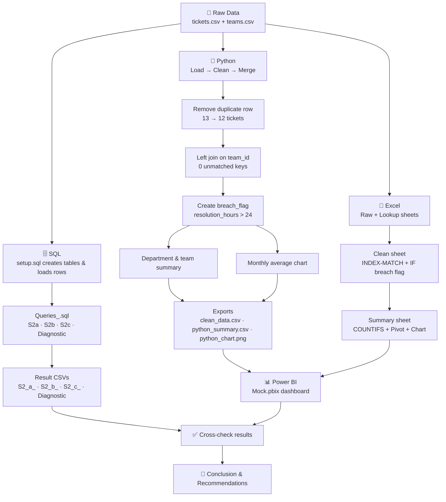

<div align="center">

# 📞 Customer Support Quality Analysis

**An end-to-end SLA & customer-satisfaction analysis using SQL, Python, Excel and Power BI**


</div>

---

## 📌 Project Details

| Field | Details |
|---|---|
| **Project Title** | Customer Support Quality Analysis |
| **Student Name** | Darshil Kotadiya |
| **Set** | B |
| **Grid** | 10311 |
| **Domain** | Customer Support / Service-Level (SLA) Analytics |
| **SLA Rule Used** | A ticket **breaches SLA** when `resolution_hours > 24` |

---

## 📖 Table of Contents
1. [Project Overview](#-project-overview)
2. [Tools Used (Image)](#-tools-used)
3. [Workflow](#-workflow)
4. [Project Folder Structure](#-project-folder-structure)
5. [Dataset Filenames & Data Dictionary](#-dataset-filenames--data-dictionary)
6. [Tools & Versions Used](#-tools--versions-used)
7. [SQL Code Explanation](#-sql-code-explanation)
8. [Python Code Explanation](#-python-code-explanation)
9. [Excel & Power BI](#-excel--power-bi)
10. [Key Results](#-key-results)
11. [Working Video](#-working-video)
12. [Conclusion](#-conclusion)

---

## 🎯 Project Overview

A customer-support centre handles tickets across **4 teams**, **2 departments** and **3 channels** over **3 months (Jan–Mar)**. This project measures *how well support is performing* by answering:

- Which **department** takes longest to resolve tickets?
- Which **teams** breach the 24-hour SLA?
- Which **channels** produce the most SLA breaches?
- How does **satisfaction** relate to resolution speed?

The same question set is solved in **four tools** (SQL, Python, Excel, Power BI) so the results can be cross-checked.

---

## 🛠 Tools Used

<div align="center">

&nbsp;&nbsp;&nbsp;
&nbsp;&nbsp;&nbsp;
&nbsp;&nbsp;&nbsp;
&nbsp;&nbsp;&nbsp;
&nbsp;&nbsp;&nbsp;
&nbsp;&nbsp;&nbsp;


**SQL · Python · Pandas · Jupyter · Excel · Power BI · GitHub**

</div>

### Chart produced in this project (Python / Matplotlib)

<div align="center">
  
  <p><em>Monthly Average Resolution Hours — Jan 24.0 · Feb 24.0 · Mar 23.5</em></p>
</div>

---

## 🔄 Workflow



**Step-by-step**

1. **Load** `tickets.csv` and `teams.csv`.
2. **Clean** – fix numeric types and drop the one exact duplicate ticket (`ticket_id = 12`).
3. **Merge** – attach `team` and `department` to every ticket using `team_id`.
4. **Validate** – confirm 12 rows and 0 unmatched team IDs (SQL *Diagnostic* + Python `assert`).
5. **Derive** – add `breach_flag` (1 if `resolution_hours > 24`).
6. **Analyse** – department averages, team SLA breaches, channel breaches, breach rates, monthly trend.
7. **Visualise** – Python bar chart, Excel pivot/chart, Power BI dashboard.
8. **Conclude** – summarise findings and recommend actions.

---

## 📁 Project Folder Structure

```
Customer-Support-Quality-Analysis/
│
├── README.md
│
├── Data/                       # Raw input datasets
│   ├── tickets.csv
│   └── teams.csv
│
├── SQL/
│   ├── setup.sql               # Create tables + insert data
│   └── Queries_.sql            # S2a, S2b, S2c, Diagnostic queries
│
├── SQL_Outputs/                # Query result exports
│   ├── S2_a_.csv               # Avg resolution hours by department
│   ├── S2_b_.csv               # Teams breaching SLA
│   ├── S2_c_.csv               # Top 2 channels by breach count
│   └── Diagnostic              # Unmatched team-ID check
│
├── Python/
│   └── main.ipynb              # Load, clean, merge, analyse, chart, export
│
├── outputs/                    # Python exports
│   ├── clean_data.csv
│   ├── python_summary.csv
│   └── python_chart.png
│
├── Excel/
│   └── Excel_mock_2.xlsx       # Sheets: Raw, Lookup, Clean, Summary
│
├── PowerBI/
│   └── Mock.pbix               # Dashboard file
│
└── Video/
    └── (working video link / file)
```

---

## 🗂 Dataset Filenames & Data Dictionary

### Input datasets

| File | Rows | Description |
|---|---|---|
| `tickets.csv` | 13 (12 after de-duplication) | One row per support ticket |
| `teams.csv` | 4 | Lookup: team → department |

### Generated / output files

| File | Produced by | Description |
|---|---|---|
| `clean_data.csv` | Python | Cleaned, merged tickets with `breach_flag` (12 rows) |
| `python_summary.csv` | Python | Department-level total tickets, breaches, breach rate |
| `python_chart.png` | Python | Monthly average resolution hours bar chart |
| `S2_a_.csv` | SQL | Avg resolution hours by department |
| `S2_b_.csv` | SQL | Teams whose average resolution exceeds 24 hrs |
| `S2_c_.csv` | SQL | Top two channels by breach count |
| `Diagnostic` | SQL | Count of unmatched team IDs (result = 0) |
| `Excel_mock_2.xlsx` | Excel | Raw, Lookup, Clean and Summary sheets |
| `Mock.pbix` | Power BI | Interactive dashboard |

### Data dictionary — `tickets.csv`

| Column | Type | Description | Example |
|---|---|---|---|
| `ticket_id` | INT | Unique ticket number | 1 |
| `month` | TEXT | Month ticket was raised (Jan, Feb, Mar) | Jan |
| `team_id` | TEXT | Handling team key (FK → `teams.team_id`) | T1 |
| `channel` | TEXT | Contact channel: Email, Chat, Phone | Email |
| `resolution_hours` | INT | Hours taken to resolve the ticket | 12 |
| `satisfaction` | INT | Customer rating, 1 (low) – 5 (high) | 4 |

### Data dictionary — `teams.csv`

| Column | Type | Description | Example |
|---|---|---|---|
| `team_id` | TEXT | Unique team key (PK) | T1 |
| `team` | TEXT | Team name | AccountCare |
| `department` | TEXT | Service or Technical | Service |

| team_id | team | department |
|---|---|---|
| T1 | AccountCare | Service |
| T2 | BillingHelp | Service |
| T3 | AppSupport | Technical |
| T4 | DeviceHelp | Technical |

### Derived columns — `clean_data.csv`

| Column | Type | Description |
|---|---|---|
| `team` | TEXT | Team name added from `teams.csv` |
| `department` | TEXT | Department added from `teams.csv` |
| `breach_flag` | INT (0/1) | `1` if `resolution_hours > 24`, else `0` |

### Derived columns — `python_summary.csv`

| Column | Description |
|---|---|
| `department` | Service / Technical |
| `total_tickets` | Number of tickets |
| `breached_tickets` | Tickets with `breach_flag = 1` |
| `sla_breach_rate` | `breached_tickets / total_tickets × 100` |

### Data quality notes
- `tickets.csv` contains **one exact duplicate row** (`ticket_id = 12`) → removed, leaving **12** tickets.
- All 12 tickets match a team → **0 unmatched keys**.

---

## ⚙ Tools & Versions Used

| Tool | Version | Purpose |
|---|---|---|
| Python | 3.14.4 | Data cleaning, analysis, charting |
| Pandas | _add your version (`pip show pandas`)_ | DataFrames, merge, groupby |
| Matplotlib | _add your version (`pip show matplotlib`)_ | Bar chart |
| Jupyter Notebook | _add your version_ | Running `main.ipynb` |
| SQL (PostgreSQL syntax) | _add your version_ | Queries & validation |
| Microsoft Excel | _add your version_ | INDEX-MATCH, COUNTIFS, Pivot Table, chart |
| Power BI Desktop | _add your version_ | Dashboard (DAX measures, slicer) |
| GitHub | – | Version control & submission |

---

## 🗄 SQL Code Explanation

### `setup.sql` — database setup
- Creates the `mock` database and two tables: **`tickets`** (6 columns) and **`teams`** (3 columns).
- Inserts 12 ticket rows (Jan–Mar × teams T1–T4) and the 4 team rows.

### `Queries_.sql`

**S2a — Average resolution time by department**
```sql
SELECT t.department,
       AVG(tk.resolution_hours) AS avg_resolution_hours
FROM tickets tk
JOIN teams t ON tk.team_id = t.team_id
GROUP BY t.department
ORDER BY avg_resolution_hours DESC;
```
- `JOIN` links each ticket to its team's department via `team_id`.
- `GROUP BY department` + `AVG()` gives the mean resolution time per department.
- `ORDER BY ... DESC` shows the slowest department first.
- **Result:** Technical = **28.33 hrs**, Service = **19.33 hrs**.

**S2b — Teams breaching SLA**
```sql
SELECT t.team,
       AVG(tk.resolution_hours) AS avg_resolution_hours
FROM tickets tk
JOIN teams t ON tk.team_id = t.team_id
GROUP BY t.team
HAVING AVG(tk.resolution_hours) > 24;
```
- `HAVING` filters *after* aggregation, keeping only teams whose **average** exceeds 24 hrs (`WHERE` cannot filter on `AVG()`).
- **Result:** AppSupport 28.67, DeviceHelp 28.00, BillingHelp 26.67. AccountCare (12.00) is within SLA.

**S2c — Top two channels by breach count**
```sql
SELECT channel, COUNT(*) AS breach_count
FROM tickets
WHERE resolution_hours > 24
GROUP BY channel
ORDER BY breach_count DESC, channel ASC
LIMIT 2;
```
- `WHERE` keeps only breached tickets (row-level filter, *before* grouping).
- `COUNT(*)` counts breaches per channel; `ORDER BY ... , channel ASC` breaks ties alphabetically; `LIMIT 2` keeps the top two.
- **Result:** Chat = **3**, Phone = **2** (Email has 0).

**Diagnostic — Unmatched team IDs**
```sql
SELECT COUNT(*) AS unmatched_keys
FROM tickets tk
LEFT JOIN teams t ON tk.team_id = t.team_id
WHERE t.team_id IS NULL;
```
- A `LEFT JOIN` keeps every ticket; rows where the teams side is `NULL` have no matching team.
- **Result:** `0` → the join is safe and no tickets are lost.

---

## 🐍 Python Code Explanation

All code lives in `main.ipynb` and is split into three parts.

### P1 — Load, Clean & Merge
```python
tickets = pd.read_csv(".../tickets.csv")
teams   = pd.read_csv(".../teams.csv")
```
Loads both CSVs (tickets shape `(13, 6)`, teams `(4, 3)`).

```python
tickets["resolution_hours"] = pd.to_numeric(tickets["resolution_hours"], errors="coerce")
tickets["satisfaction"]     = pd.to_numeric(tickets["satisfaction"], errors="coerce")
```
Forces numeric types; invalid values would become `NaN` instead of crashing.

```python
tickets = tickets.drop_duplicates()                      # 13 -> 12 rows
merged  = tickets.merge(teams, on="team_id", how="left")
assert len(merged) == 12
assert merged["department"].isna().sum() == 0
```
Removes the duplicate ticket, left-joins teams, and uses `assert` to prove nothing was lost or unmatched.

### P2 — Derived Field & Department Analysis
```python
merged["breach_flag"] = (merged["resolution_hours"] > 24).astype(int)
```
Creates the SLA flag (1 = breached, 0 = within SLA).

```python
department_summary = (merged.groupby("department")
    .agg(total_tickets=("ticket_id", "count"),
         breached_tickets=("breach_flag", "sum"))
    .reset_index())
department_summary["sla_breach_rate"] = (
    department_summary["breached_tickets"] / department_summary["total_tickets"] * 100)
```
Counts tickets and breaches per department and computes the **SLA breach rate %**.

```python
team_summary = merged.groupby("team").agg(...)   # same logic per team
highest_team = team_summary.loc[team_summary["breach_rate"].idxmax()]
```
Repeats the calculation per team and uses `idxmax()` to find the team with the highest breach rate.

> ⚠️ **Tie note:** AppSupport and BillingHelp both have a 66.67 % breach rate (2 of 3 tickets). `idxmax()` returns only the *first* match (AppSupport), so report both teams as tied — or add a tie-breaker such as average resolution hours (AppSupport is higher at 28.67).

### P3 — Chart & Exports
```python
monthly_avg = (merged.groupby("month")["resolution_hours"].mean()
               .reindex(["Jan", "Feb", "Mar"]))
```
Calculates monthly average resolution time; `reindex` keeps months in calendar order (not alphabetical).

```python
plt.bar(monthly_avg.index, monthly_avg.values)
plt.savefig("outputs/python_chart.png", dpi=300)
```
Draws the bar chart with title and axis labels, saved at 300 dpi.

```python
merged.to_csv("outputs/clean_data.csv", index=False)
department_summary.to_csv("outputs/python_summary.csv", index=False)
```
Exports the clean dataset and department summary.

---

## 📗 Excel & Power BI

### Excel — `Excel_mock_2.xlsx`
| Sheet | Contents |
|---|---|
| **Raw** | Original tickets (13 rows, includes duplicate) |
| **Lookup** | Team → department mapping |
| **Clean** | De-duplicated table; `department` via `INDEX(MATCH())`; `breach_flag` via `IF(resolution_hours>24,1,0)`; row counts before/after duplicate removal |
| **Summary** | `COUNTIFS` breached tickets per channel, a Pivot Table (resolution hours by department × month) and a chart |

### Power BI — `Mock.pbix`
Dashboard with:
- **KPI cards:** Ticket Count, SLA Breach Rate, Avg Satisfaction
- **Clustered bar chart:** Avg Satisfaction by department
- **Line chart:** Resolution hours by month
- **Slicer:** Channel

> 📸 *Tip: add a dashboard screenshot at `PowerBI/dashboard.png` and display it here with ``.*

---

## 📈 Key Results

| Metric | Value |
|---|---|
| Total tickets (after cleaning) | **12** |
| Total SLA breaches (> 24 hrs) | **5** (41.7 %) |
| Avg resolution — Technical / Service | **28.33 hrs / 19.33 hrs** |
| SLA breach rate — Technical / Service | **50 % / 33.3 %** |
| Teams with avg > 24 hrs | AppSupport (28.67), DeviceHelp (28.00), BillingHelp (26.67) |
| Highest team breach rate | AppSupport & BillingHelp (tie, 66.67 %) |
| Top breach channels | Chat (3), Phone (2); Email (0) |
| Monthly avg resolution | Jan 24.0 · Feb 24.0 · Mar 23.5 |
| Avg satisfaction — Service / Technical | 3.83 / 3.33 |
| Unmatched team IDs | 0 |

---

## 🎥 Working Video

📹 **Project walkthrough:** [Click here to watch the working video](PASTE_YOUR_VIDEO_LINK_HERE)

<!-- If the video file is in the repo, you can use: -->
<!-- https://github.com/<username>/<repo>/assets/<video-id> -->

The video demonstrates: running the SQL queries → executing `main.ipynb` → the Excel Clean/Summary sheets → the Power BI dashboard.

---

## ✅ Conclusion

- **Technical** is the weaker department: it has the longer average resolution time (28.33 vs 19.33 hrs) and the higher SLA breach rate (50 % vs 33 %). Its satisfaction score is also lower (3.33 vs 3.83).
- **AppSupport, DeviceHelp and BillingHelp** all average above the 24-hour SLA. **AccountCare** is the only team consistently within SLA (average 12 hrs, 0 breaches).
- **Chat** is the biggest problem channel (3 of the 5 breaches), followed by **Phone** (2). **Email** had no breaches.
- Overall performance **hovers right at the SLA line** (monthly averages 24.0, 24.0 and 23.5 hrs), with only a slight improvement in March.
- Data quality was handled properly: one duplicate ticket was removed and the join was verified with 0 unmatched keys, with SQL, Python, Excel and Power BI results consistent with each other.

**Recommendations:** add staff or training to the Technical teams, set up faster escalation for Chat and Phone tickets, and track SLA breach rate and satisfaction monthly. Note that with only 12 tickets these findings are indicative, not statistically conclusive.

---

<div align="center">

**Project:** Customer Support Quality Analysis &nbsp;|&nbsp; **Student:** Darshil Kotadiya &nbsp;|&nbsp; **Set:** B &nbsp;|&nbsp; **Grid:** 10311

</div>
